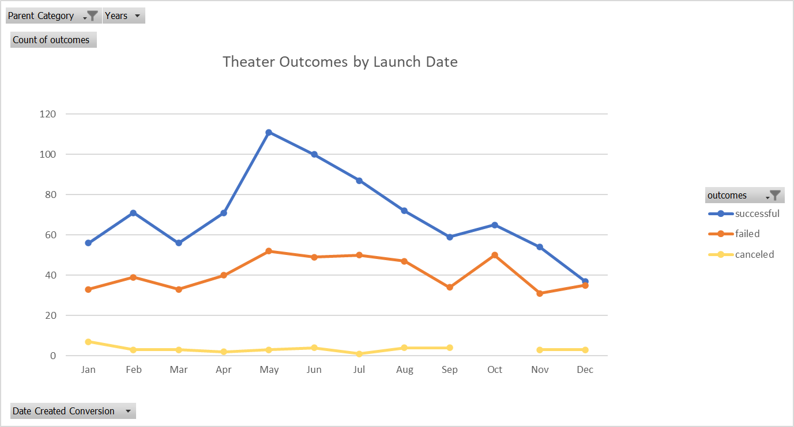
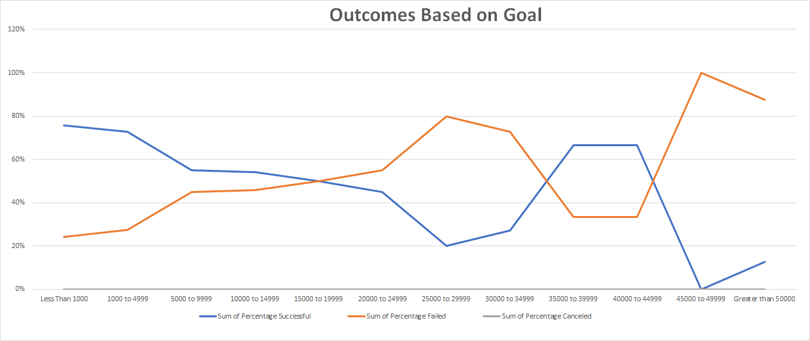

# **Kickstarting with Excel**

## **Overview of Project**

### Purpose

Analyze how other theatre Kickstarter campaigns did in comparison to Louise's play *Fever* campaign in relation to their launch dates and their funding goals.  This information will provide Louise with the knowledge of when the best time to launch the Kickstarter for her production *Fever* is based on past staticics and give an idea of the success rate of similar campaigns based on the goal amount.

## **Analysis and Challenges**

### Analysis of Outcomes Based on Launch Date

The graph above shows the relation between the launch date of a campaign and the amount of successful or failed campaigns.  This data is specific to a theater parent category and broken down by month. I obtained the data for this graph by using a simple date conversion and then using the years function to get the years value.

### Analysis of Outcomes Based on Goals

The graph above shows the correlation between the amount of a campaign’s goal and the success rates of those campaigns.  I was able to get this information by using a COUNTIFS function in order to determine how many successful campaigns there were in each range of goal amounts.

### Challenges and Difficulties Encountered

I did struggle with being able to get the data from the outcomes based on goals chart to display correctly in a graph.  It took me a while to get the Y axis to display the percentages and the lines to display the information listed in each percentages category.

## **Results**

### What are two conclusions you can draw about the Outcomes based on Launch Date?

Looking into the above graph it is clear to see that there is a large spike in successful campaigns right in the middle of the year, and more specifically the month of May.  The months of June and July also so very strong results while the month of February, April and August are still above average.  On the other hand, the month of December is well below the average and clearly the least successful month to laugh a fund raising Kickstarter.  If we look at the data for failed and canceled Kickstarter breakdown by month it does not offer much valuable information as there is only a little variance in either of the 2 categories.

### What can you conclude about the Outcomes based on Goals?

Looking at the success rate of Kickstarter campaigns based on the overall funding goal of the campaign does not offer much of a trend.  There is a very clear distinction between campaign success in Kickstarters with a goal of less than $5,000.  These campaigns have a far higher success rate than a fail rate. On the other hand, campaigns with a goal of over $45,000 have a far higher fail rate than success rate.  This does not provide much intellectual value however as these to fact are what would be expected just based on the relationship between goal amount and success rate.

### What are some limitations of this dataset?

There is one major limitation that I have noticed to this data set and that is the fact that there is no way to add or determine the amount of advertising or marketing went into each Kickstarter.  People would have to know about the Kickstarter in order to contribute.  Also, some of these plays could be in very large markets like Broadway and some could be in smaller more localized theatres causing less interest and less opportunity for funding.

### What are some other possible tables and/or graphs that we could create?

Some other graphs or charts we could create are ones that incorporate the staff pick and spotlight categories.  These 2 factors could have a major effect on the amount of funding that a campaign receives.  Some people may be looking solely at recommended Kickstarters and with the spotlight some campaigns will be listed first which would create more view and donations.
