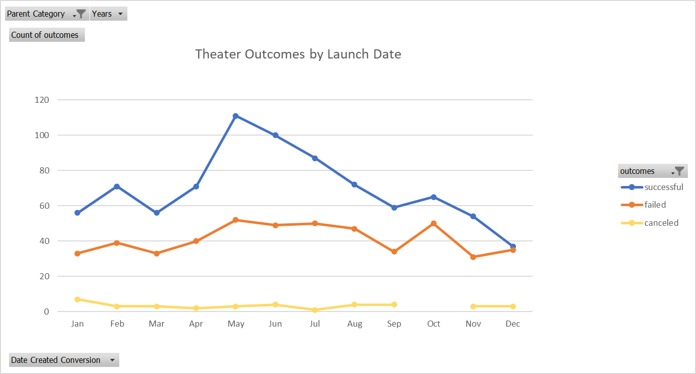
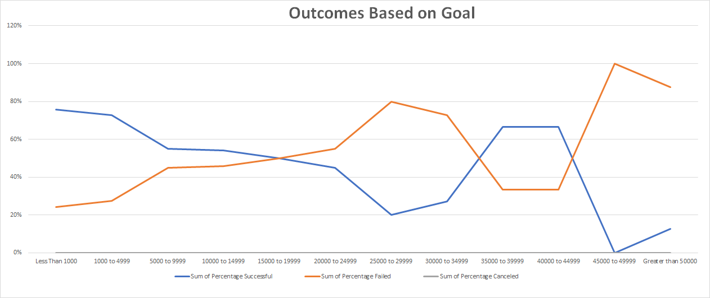

# Kickstarting with Excel

## Overview of Project

### Purpose

Analyze how other theatre Kickstarter campaigns did in comparison to Louise's play *Fever* campaign in relation to their launch dates and their funding goals.  This information will provide Louise with the knowledge of when the best time to launch the Kickstarter for her production *Fever* is based on past staticics and give an idea of the success rate of similar campaigns based on the goal amount.

## Analysis and Challenges

### Analysis of Outcomes Based on Launch Date

### Analysis of Outcomes Based on Goals

### Challenges and Difficulties Encountered

## Results

#### What are two conclusions you can draw about the Outcomes based on Launch Date?

Looking into the above graph it is clear to see that there is a large spike in successful campaigns right in the middle of the year, and more specifically the month of May.  The months of June and July also so very strong results while the month of February, April and August are still above average.  On the other hand, the month of December is well below the average and clearly the least successful month to laugh a fund raising Kickstarter.  If we look at the data for failed and canceled Kickstarter breakdown by month it does not offer much valuable information as there is only a little variance in either of the 2 categories.

#### What can you conclude about the Outcomes based on Goals?

#### What are some limitations of this dataset?

#### What are some other possible tables and/or graphs that we could create?
